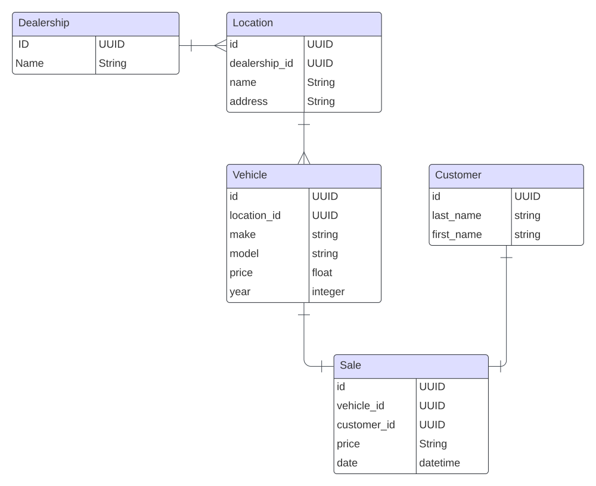

**How to run the code:**
- Get the code: `git clone git@github.com:shakoori-naeimeh/dealership.git`
- Go to project's folder: `cd dealership`
- Make sure your docker desktop is running
- Setup and start the server: `./setup.sh`


**Test the APIs:**

After the server is up and running, go to localhost:3000/graphql and try the query below:

```
query {
  getVehicles(make: "tesla") {
    id
    make
    model
    year
    price
  }
}
```

Prisma ships with a powerful database GUI. Run Prisma Studio to see the tables: `npx prisma studio`

**Data model:**



APIs:

Fetch a `vehicle` with its `id`:

```
query getVehicle($id: String!) {
  getVehicle(id: $id) {
    id
    make
    model
    year
    price
  }
}
```

Fetch an array of `vehicle` filtered by any or all of the parameters `make`, `model`, `year`:

```
query getVehicles($make: String, $model: String, $year: Int) {
  getVehicles(make: $make, model: $model, year: $year) {
    id
    make
    model
    year
    price
  }
}
```

Add a new vehicle:

```
mutation addVehicle($make: String!, $model: String!, $year: Int!, $price: Float!, $locationId: String!) {
  addVehicle(make: $make, model: $model, year: $year, price: $price, locationId: $locationId) {
    id
    make
    model
    year
    price
  }
}
```
